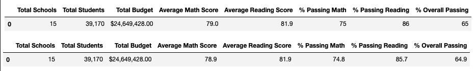
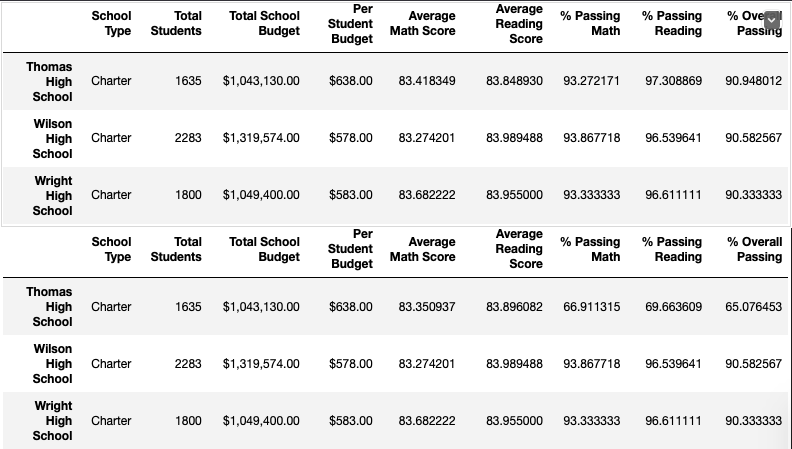

# School_District_Analysis
## Overview of the school district analysis: Explain the purpose of this analysis.
As we worked through this module, we managed to gather plenty of data to help with this analysis. We performed calculations including taking the average scores for each school in math, reading, and then overall, as well as the percentages for the same categories. We also calculated the total budget per each school, as well as the amount spent per each student. In working through the data, we are able to go through different schools and zoom in on their different statistics, if needed. In this specific analysis, we are focusing on Thomas High School and replacing the ninth grade's math and reading scores with NaNs in order to evaluate the data properly without any dishonesty. We are exploring how making these changes will affect the overall analysis.

## Results: Using bulleted lists and images of DataFrames as support, address the following questions:
#### ***Note: For the pictures, the top picture is the original analysis and the bottom picture is the challenge analysis.***

- ### How is the district summary affected?
  - 

  - While looking at the district summary, we can see the subtle differences in the average math scores and in the passing math, reading, and overall percentages. For the average math score, there is approximately a 0.1 difference in the scores; 79.0 in the original and 78.9 in the Thomas Analysis. For the passing math percentage, there is approximately a 0.2 difference in the percentages; 75% in the original and 74.8% in the Thomas Analysis. For the passing reading percentage, there is approximately a 0.3 difference in the percentages; 86% in the original and 85.7% in the Thomas Analysis. For the overall passing percentage, there is approximately a 0.1 difference in the percentages; 65% in the original and 64.9% in the Thomas Analysis. Overall, the Thomas Analysis has a slight change -- lower percentage -- in its percentages.

- ### How is the school summary affected?

Comparing the Thomas High School data from the original to the one in the challenge, there are significants changes for the percentage categories. If we look at the average math and reading scores, there are minimal differences between the two: 1) approximately a 0.07 difference (when rounding to the hundreth place) between the original summary (83.42) and the Thomas summary (83.35) in the average math score and 2) approximately a 0.05 difference between the original (83.85) and the Thomas summary (83.90) in the average reading score. Between the original analysis and the Thomas analysis, the passing percentages dropped extensively with the drop estimating from 17% to 25%. We can conclude that the school summary was significantly affected by the cahnge in scores.

- ### How does replacing the ninth graders’ math and reading scores affect Thomas High School’s performance relative to the other schools?

- ### How does replacing the ninth-grade scores affect the following:

- ### Math and reading scores by grade

- ### Scores by school spending

- ### Scores by school size

- ### Scores by school type
  - [Type Summary with decimal points](Images/Type_Summary.png)

  - [Type Summary with formatted decimal points](Images/Type_Summary_2.png)
## Summary: Summarize four changes in the updated school district analysis after reading and math scores for the ninth grade at Thomas High School have been replaced with NaNs.
1.
2.
3.
4.
